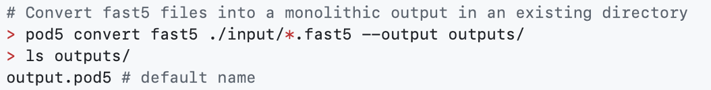
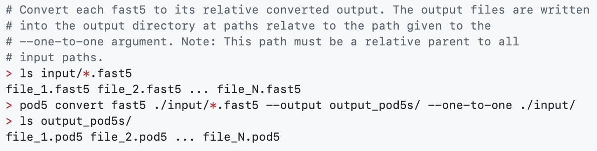
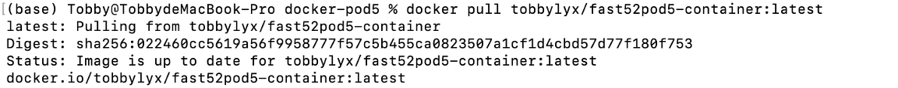
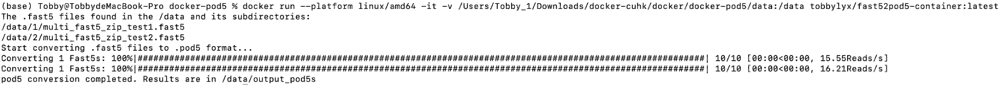

# How to run docker of pod5 conversion

## Introduction for entrypoint.sh
Develop docker to do pod5 conversion for all fast5 files, which boot automatically scans all fast5 files in the **/data** directory when start docker.

## Introduction for pod5 conversion
Convert fast5 files into a monolithic output file:


Convert fast5 files into a monolithic output in an existing directory:


Convert each fast5 to its relative converted output. The output files are written into the output directory at paths relatve to the path given to the —-one-to-one argument. Note: This path must be a relative parent to all input paths.


## How to use entrypoint.sh
Use terminal of **MacOS platform** as example, the image is successfully pushed to test Docker Hub repository.

First, you need to pull the image from Docker Hub. You can use the TAB to pull up the latest version.

```
docker pull tobbylyx/fast52pod5-container:latest
```


Make sure that you have mounted the directory containing the **.fast5** file to the **/data** directory of the Docker container. This can be set in the docker run command by using the **-v** or **--volume** arguments:

```
docker run --platform linux/amd64 -it -v /Users/Tobby_1/Downloads/docker-cuhk/docker/docker-pod5/data: /data tobbylyx/fast52pod5-container:latest
```
And the output result will shown on the terminal:


If not find any fastq.gz, give an error message:

```
Error: No .fast5 files found in /data.
```


## The output of entrypoint.sh
The **./entrypoint.sh** will scan and find all fast5 files, and do pod5 conversion. The pod5 conversion output will store in **/data/output_pod5s**, The original file structure is also preserved intact.
